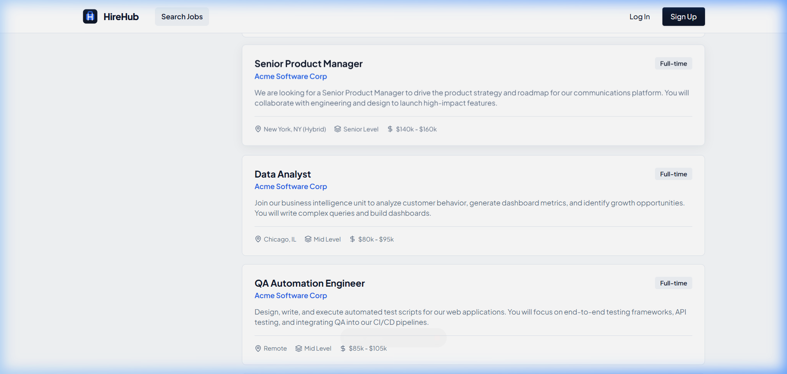
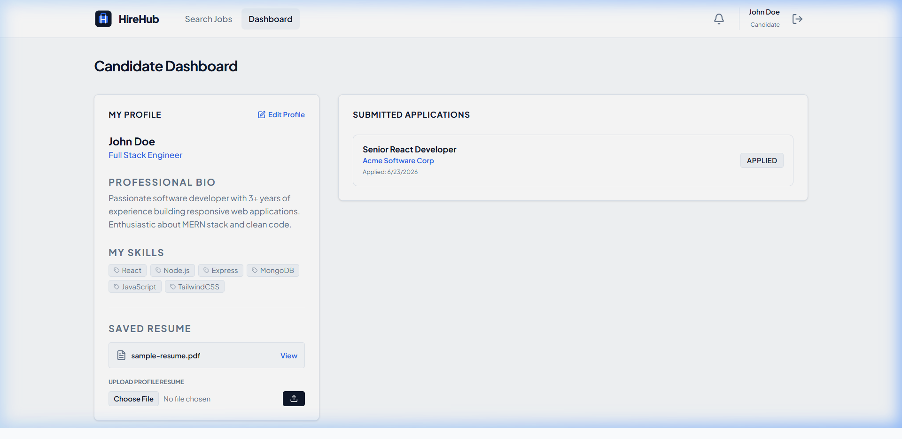
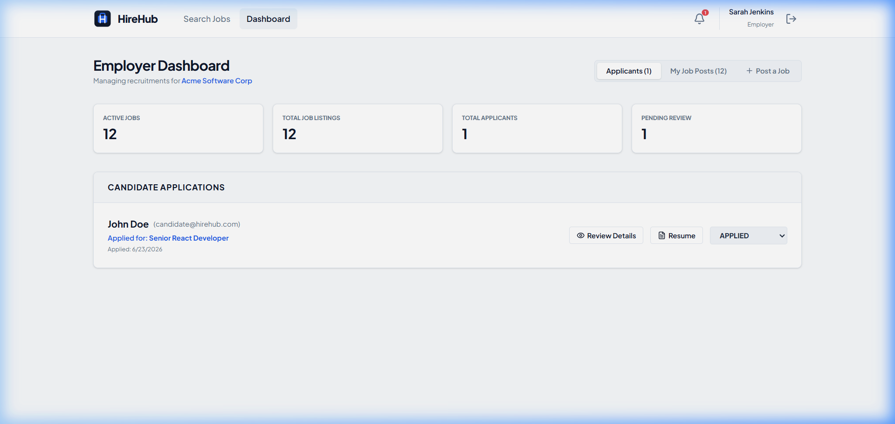

# HireHub - Professional Job Board Platform

HireHub is a modern, feature-rich Job Board Platform built using the MERN stack (MongoDB, Express, React, Node.js). The application serves as a bridge between job seekers (candidates) looking for career opportunities and companies (employers) searching for top talent.

---

## 📸 Screenshots

Here are some previews of the platform:

### 🏠 Home Page
A clean, welcoming landing page where users can explore job opportunities, learn about the platform, and navigate to log in or register.


### 👤 Candidate Dashboard
A personalized interface for job seekers to browse available job posts, view detailed job descriptions, manage their profiles, upload resumes, and track the status of their job applications.


### 🏢 Employer Dashboard
A robust dashboard for recruiters and company representatives to publish new job listings, edit existing job posts, view incoming applications, and review candidate details (including resumes).


---

## 🚀 Key Features

*   **Role-Based Access Control:** Separate registration and custom workflows for Candidates, Employers, and Admins.
*   **Job Management:** Employers can create, read, update, and delete job postings with custom requirements, salary ranges, location types (Remote/On-site/Hybrid), and job types (Full-time/Part-time/Contract).
*   **Application Tracking:** Candidates can apply to jobs with their profile details and uploaded resumes. Applications update dynamically on the employer's dashboard.
*   **Resume Upload:** Built-in PDF/Word file upload system using `multer` for candidate resumes.
*   **Admin Control Panel:** Administrator interface to monitor stats (active jobs, total applications, total candidates vs. employers) and manage user accounts.
*   **Clean and Premium UI:** Modern dashboard designs with responsive layouts and hover effects.

---

## 🛠️ Technology Stack

*   **Frontend:** React.js, Vite, Tailwind CSS, React Router DOM, Context API
*   **Backend:** Node.js, Express.js
*   **Database:** MongoDB, Mongoose ODM
*   **Authentication:** JSON Web Tokens (JWT), BcryptJS (for password hashing)
*   **File Uploads:** Multer (handling PDF/Word resume uploads)

---

## ⚙️ Project Structure

```text
JOB-BOARD-PLATFORM/
├── backend/                  # Express.js backend server
│   ├── middleware/           # Route guards and authentication middlewares
│   ├── models/               # MongoDB models (User, Job, Application, etc.)
│   ├── routes/               # API endpoint handlers
│   ├── uploads/              # Local folder storing candidate resumes
│   ├── .env                  # Backend environment configurations
│   └── server.js             # Express server entry point
├── frontend/                 # React frontend application
│   ├── public/               # Static assets & screenshots
│   │   └── screenshots/      # Screenshots shown in this README
│   ├── src/
│   │   ├── components/       # Shared UI components (Navbar, ProtectedRoute)
│   │   ├── context/          # React Contexts (Auth and Notification)
│   │   ├── pages/            # Page views (Home, Login, Dashboards)
│   │   └── App.jsx           # Frontend routes configuration
│   └── tailwind.config.js    # Tailwind styling configurations
└── package.json              # Workspace root configurations
```

---

## 🏃 Getting Started

### 1. Prerequisites
Ensure you have the following installed:
*   [Node.js](https://nodejs.org/) (v16+ recommended)
*   [MongoDB](https://www.mongodb.com/) (either running locally or a MongoDB Atlas URI)

### 2. Environment Setup
Configure the backend environmental variables. Create a `.env` file in the `backend/` directory:

```env
PORT=5000
MONGO_URI=your_mongodb_connection_uri
JWT_SECRET=your_jwt_secret_key
```

### 3. Install Dependencies
You can install dependencies for the root folder, backend, and frontend with a single command from the project root:

```bash
npm run install-all
```

### 4. Running the Application
To run both the backend API server and frontend React dev server concurrently, run the following command from the root directory:

```bash
npm run dev
```

*   **Frontend App:** `http://localhost:5173`
*   **Backend API:** `http://localhost:5000`

---

## 🔑 Test Credentials

The database contains pre-configured test accounts for testing and exploration. Feel free to log in with these credentials:

| Role | Email | Password |
| :--- | :--- | :--- |
| **Candidate** | `candidate@hirehub.com` | `password123` |
| **Employer** | `employer@acme.com` | `password123` |
| **Admin** | `admin@hirehub.com` | `password123` |
